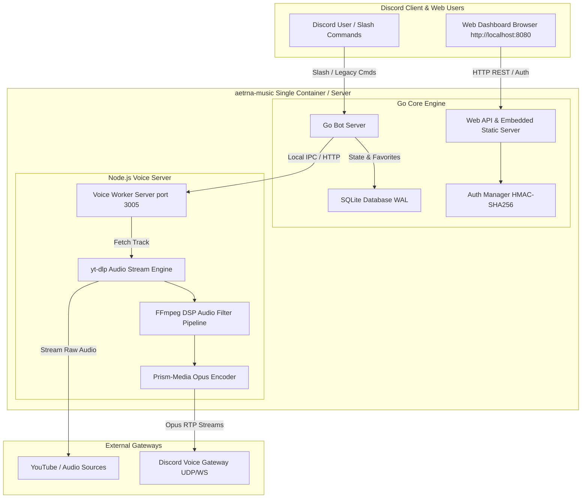

<div align="center">

<br />
<sub><i>Official Bot Artwork by <b>@br_lie</b></i></sub>

# aetrna-music

> **discord music bot. unfortunately.**
> *A self-hosted, Lavalink-free Discord music bot & web dashboard.*

[](https://go.dev/)
[](https://nodejs.org/)
[](https://www.docker.com/)
[](#web-control-panel--dashboard)
[](LICENSE)
[](CONTRIBUTING.md)

<br /><br />

> *“Gua cuma Professional AI Prompter. Kalo kodenya agak ajaib tapi lagunya muter lancar jaya, berarti prompt gua gacor.”*
> <br />
> — **[zidanaetrna](https://github.com/zidanaetrna)** *(Professional AI Prompter)*

---

</div>

## Why aetrna-music?

- **Lavalink-Free**: No separate Lavalink server or Java runtime required. Lightweight native Go + Node.js architecture.
- **Self-Hosted**: Run everything on your own server with full control.
- **Web Dashboard**: React 18 + TypeScript control panel to manage playback directly from your browser.
- **Audio Filters**: On-the-fly FFmpeg DSP filters (`bassboost`, `nightcore`, `vaporwave`, `8d`, `pop`).
- **Synced LRC Lyrics**: Live line-by-line synchronized lyrics directly in Discord embeds (`/lyrics`).
- **Docker-Ready**: Instant containerized setup without assembling dependencies manually.

---

## Quick Start & Installation

### Option 1: Interactive CLI Setup Wizard (Recommended)

Run the interactive wizard to generate `.env` and initialize configuration:

```bash
npx aetrna-music init
```

### Option 2: Docker Compose (Recommended for servers)

1. **Clone repository**:
   ```bash
   git clone https://github.com/zidanaetrna/aetrna-music.git
   cd aetrna-music
   ```

2. **Copy environment template**:
   ```bash
   cp .env.example .env
   ```
   Edit `.env` and set your `DISCORD_TOKEN` and `DASHBOARD_PASSWORD`.

3. **Start container**:
   ```bash
   docker compose up -d
   ```
   *Your bot is now running, and the Web Dashboard is live at `http://localhost:8080`!*

### Option 3: Manual Execution (Local Run)

#### Prerequisites:
- **Go**: `1.23+`
- **Node.js**: `22+`
- **FFmpeg**: Installed and added to system `PATH`
- **yt-dlp**: Installed and added to system `PATH`

1. **Install Node dependencies**:
   ```bash
   npm install
   ```

2. **Start Voice Worker (Terminal 1)**:
   ```bash
   node voice-server/server.js
   ```

3. **Start Go Core Bot & Web Server (Terminal 2)**:
   ```bash
   go run ./cmd/bot
   ```

---

## Web Control Panel / Dashboard

`aetrna-music` comes with a modern React 18 + TypeScript Web Dashboard accessible at `http://localhost:8080`.

- **React 18 + TypeScript + Vite**: Built with modern component architecture, strict type safety, and embedded into the Go executable (`//go:embed all:dist`).
- **Real-Time Telemetry**: Live status updates for RAM usage, active guild counts, and server uptime.
- **Cloudflare Dark Charcoal UI**: Collapsible sidebar (`250px` vs `64px`), quick search shortcut (`Ctrl + K`), and unified Deep Emerald Green theme (`#10B981`).
- **Multi-Guild Target Selector**: Switch between connected Discord servers to manage queues and playback controls.
- **Multi-Language Support**: Switch between English, Natural Tech Indonesian, and Japanese with sleek toast notifications.
- **Password Protected**: HMAC-SHA256 authenticated session via `.env` (`DASHBOARD_PASSWORD`).

---

## Command Reference

| Command | Category | Description |
|---|---|---|
| `/play <query>` | Playback | Search or queue track/playlist from YouTube or Spotify |
| `/search <query>` | Playback | Search tracks with interactive dropdown menu |
| `/pause` / `/resume` | Playback | Pause or resume audio playback |
| `/skip` | Playback | Skip to the next track in queue |
| `/stop` | Playback | Stop playback, clear queue, and leave voice channel |
| `/queue` | Queue | View paginated queue table with progress bar |
| `/nowplaying` | Queue | View Now Playing card with interactive control buttons |
| `/lyrics` | Playback | Fetch synced line-by-line LRC lyrics for current track |
| `/favorite` | Favorites | Save current song to your personal SQLite favorites |
| `/favorites` | Favorites | View and play your saved favorite songs |
| `/collection` | Collection | Save or load custom user playlists (`save <name>`, `load <name>`) |
| `/filter <name>` | DSP Filter | Apply FFmpeg audio filters (`bassboost`, `nightcore`, `vaporwave`, `8d`, `pop`) |
| `/stats` | System | View bot performance & RAM usage |
| `/ping` | System | Check bot heartbeat and WebSocket latency |
| `/ytauth` | Admin | YouTube authentication & cookie troubleshooting guide |

---

## YouTube Cookies Configuration

YouTube frequently blocks data center IPs or restricts age-gated tracks. To ensure smooth playback, supply a `youtube_cookies.txt` file. Refer to the **[YouTube Cookies Setup Guide](docs/YOUTUBE_COOKIES.md)** for details.

---

## Architecture Overview



---

## Support & EVM Donations

If you find `aetrna-music` useful, consider supporting the project:

**EVM Wallet Address** (ETH / BSC / Polygon / Arbitrum / Base / Optimism):
```text
0xA1a4d3F3A49f4514CCEE434Cfc66837A1fFC687d
```

---

## License & Credits

- **License**: Released under the **[Apache License 2.0](LICENSE)**.
- **Creator**: **[zidanaetrna](https://github.com/zidanaetrna)** *(Professional AI Prompter)*
- **Official Bot Artwork**: **[@br_lie](https://github.com/TheBarli)** (`web/public/artwork.png`)

<div align="center">
  <sub>Built by <b>zidanaetrna</b> using Go & Node.js</sub>
</div>
