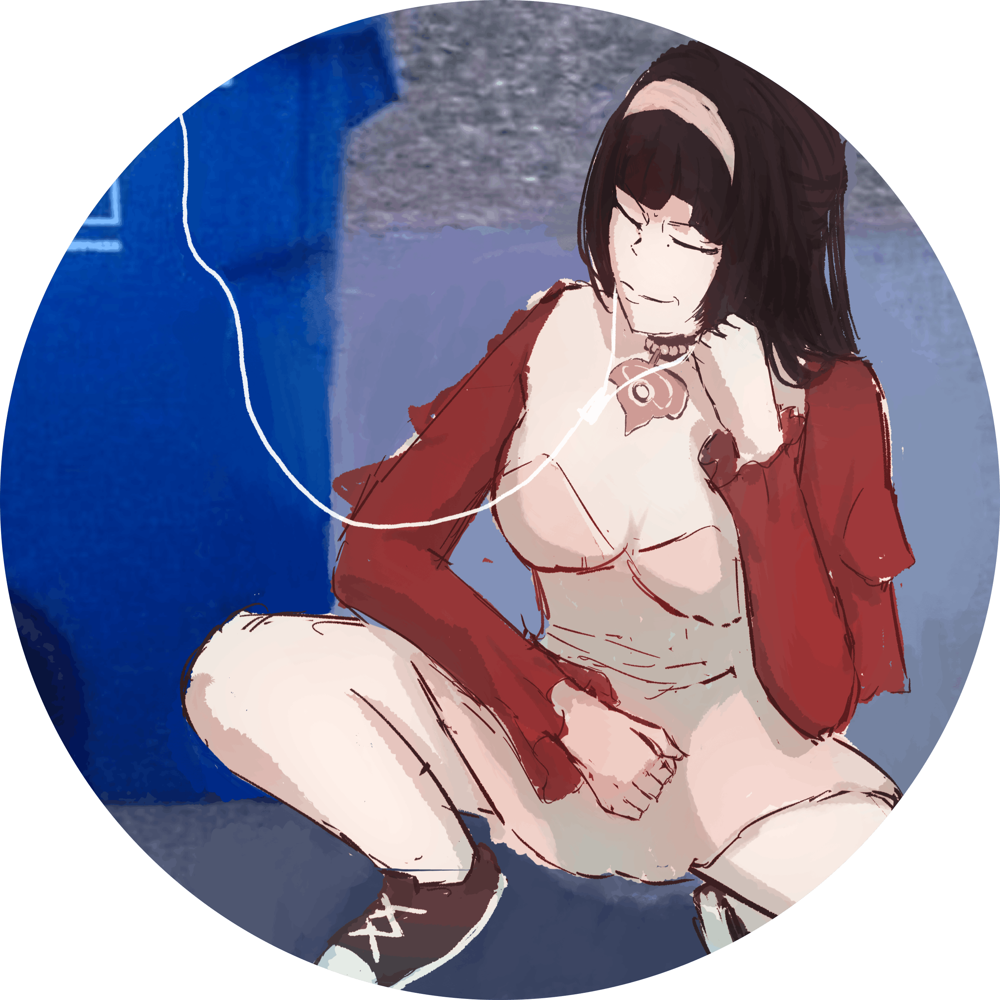
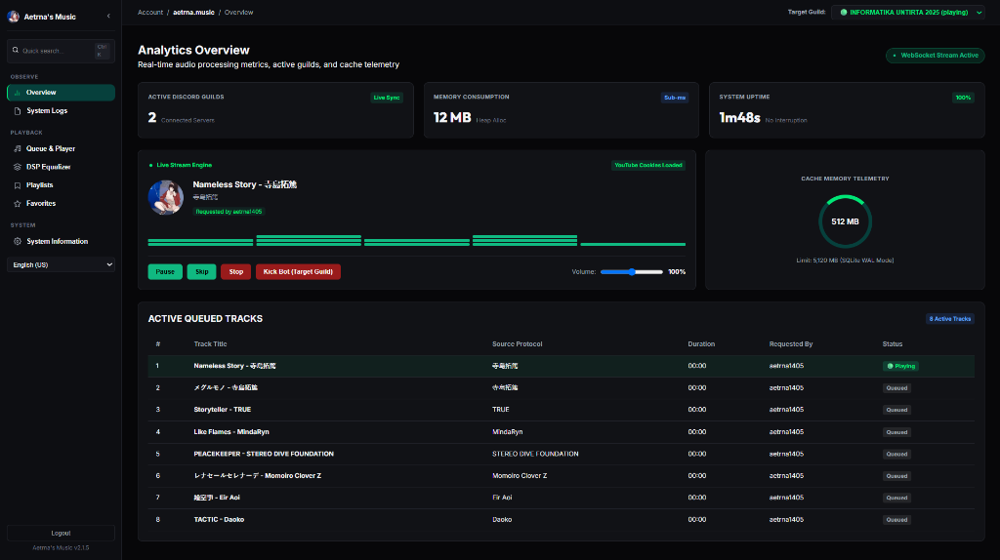
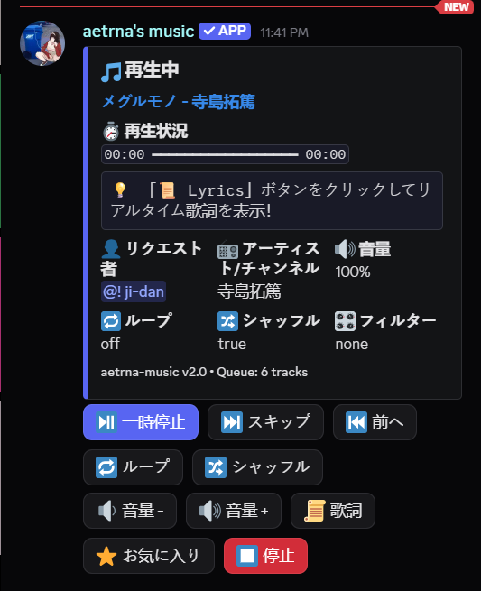
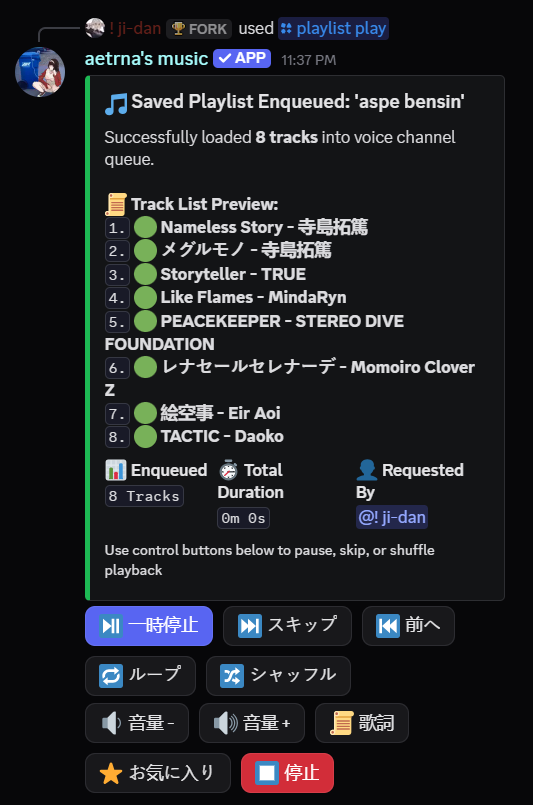
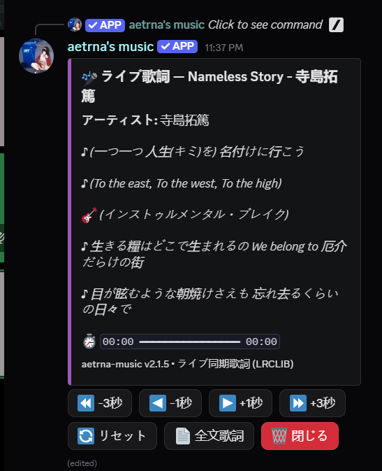
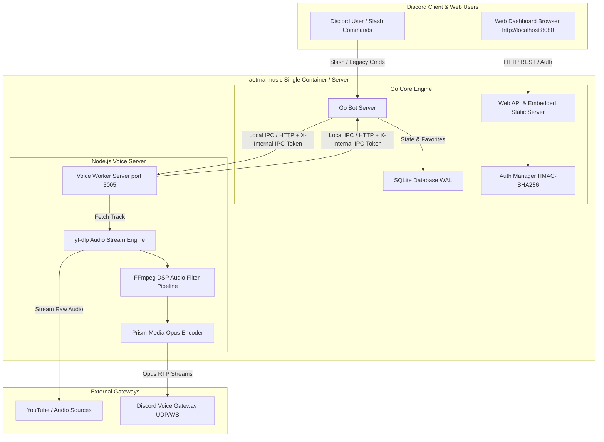

<div align="center">

<br />
<sub><i>Official Bot Artwork by <b>@br_lie</b></i></sub>

# aetrna-music

> **discord music bot. unfortunately.**
> *A self-hosted, Lavalink-free Discord music bot & web dashboard.*

[](https://go.dev/)
[](https://nodejs.org/)
[](https://www.docker.com/)
[](#web-control-panel--dashboard)
[](LICENSE)
[](CONTRIBUTING.md)

<br /><br />

> *“Gua cuma Professional AI Prompter. Kalo kodenya agak ajaib tapi lagunya muter lancar jaya, berarti prompt gua gacor.”*
> <br />
> — **[zidanaetrna](https://github.com/zidanaetrna)** *(Professional AI Prompter)*

---

</div>

## 📸 Showcase & Feature Demo

### 🌐 Real-Time Web Control Panel
Analytics overview, live audio stream telemetry, memory consumption metrics, active queue inspector, and multi-guild server selector.



<br />

| 🎧 Interactive Now Playing Card (`/nowplaying`) | 🎵 Rich Hybrid Embed Playlist (`/playlist play`) | 🎤 Live Synced LRC Lyrics (`/lyrics`) |
| :---: | :---: | :---: |
|  |  |  |

---

## Why aetrna-music?

- **Lavalink-Free**: No separate Lavalink server or Java runtime required. Lightweight native Go + Node.js architecture.
- **Self-Hosted**: Run everything on your own server with full control.
- **Web Dashboard**: React 18 + TypeScript control panel with real-time stream status, active queue inspector, memory consumption telemetry, and multi-guild switcher.
- **Rich Hybrid Embed UI**: Aesthetic Discord embed cards with full-width thumbnails, clickable track list previews (`1. 🟢 [Title](URL) (3:45)`), and 2-row interactive control button matrices (`[ Pause ]`, `[ Skip ]`, `[ Prev ]`, `[ Loop ]`, `[ Shuffle ]`, `[ Vol- ]`, `[ Vol+ ]`, `[ Lyrics ]`, `[ Favorite ]`, `[ Stop ]`).
- **Custom Saved Playlists**: Create, save, manage, and play custom user playlists (`/playlist create`, `/playlist add-track`, `/playlist play`, `/playlist list-tracks`). Supports YouTube links, Spotify URLs, and manual title searches (`query: FLOW Sign`).
- **Synced LRC Lyrics**: Live line-by-line synchronized lyrics directly in Discord embeds with dual-orientation matching (`Title - Artist` vs `Artist - Title`) for Japanese/Anime/J-Pop tracks (`/lyrics`).
- **Audio Filters**: On-the-fly FFmpeg DSP filters (`bassboost`, `nightcore`, `vaporwave`, `8d`, `pop`).
- **Docker-Ready**: Instant containerized setup without assembling dependencies manually.
- **Smart YouTube Search Ranker**: Deterministic 5-candidate ranking in Go (< 0.05ms) with zero network overhead. Solve broadcaster TV-size clip traps for anime/J-Pop queries without query manipulation. [Read full documentation in docs/search-ranking.md](docs/search-ranking.md).

## Try the Bot

A public instance is available if you want to test things out before setting up your own.

[Add to your server](https://discord.com/oauth2/authorize?client_id=1460301126854246541&scope=bot%20applications.commands&permissions=11922048)

It's the same codebase. No guarantees on uptime.

---

## Quick Start & Installation

### Option 1: Interactive CLI Setup Wizard (Recommended)

Run the interactive wizard to generate `.env` and initialize configuration:

```bash
npx aetrna-music init
```

### Option 2: Docker Compose (Recommended for servers)

1. **Clone repository**:
   ```bash
   git clone https://github.com/zidanaetrna/aetrna-music.git
   cd aetrna-music
   ```

2. **Copy environment template**:
   ```bash
   cp .env.example .env
   ```
   Edit `.env` and set at minimum your `DISCORD_TOKEN` and `ADMIN_KEY` (fallback: `DASHBOARD_PASSWORD` still works for legacy configs).

3. **Optional: Add YouTube cookies for unrestricted playback**:
   ```bash
   # Copy your exported Netscape-format YouTube cookies here
   cp /path/to/exported.txt ./cookies.txt
   ```
   See the **[YouTube Cookies Setup Guide](docs/YOUTUBE_COOKIES.md)** for step-by-step instructions. `docker-compose.yml` automatically mounts `./cookies.txt` into `/app/cookies.txt` inside the container (read+write, not read-only — yt-dlp needs to update cookie expiry state).

4. **Start container**:
   ```bash
   docker compose up -d --build
   ```
   *Your bot is now running, and the Web Dashboard is live at `http://localhost:8080`!*

### Option 3: Manual Execution (Local Run)

#### Prerequisites:
- **Go**: `1.23+`
- **Node.js**: `22+`
- **FFmpeg**: Installed and added to system `PATH`
- **yt-dlp**: Installed and added to system `PATH`

1. **Install Node dependencies**:
   ```bash
   npm install
   ```

2. **Start Voice Worker (Terminal 1)**:
   ```bash
   node voice-server/server.js
   ```

3. **Start Go Core Bot & Web Server (Terminal 2)**:
   ```bash
   go run ./cmd/bot
   ```

---

## Web Control Panel / Dashboard

`aetrna-music` comes with a modern React 18 + TypeScript Web Dashboard accessible at `http://localhost:8080`.

- **React 18 + TypeScript + Vite**: Built with modern component architecture, strict type safety, and embedded into the Go executable (`//go:embed all:dist`).
- **Real-Time Telemetry & Audio Stream Inspector**: Live WebSocket status updates for active guild stream engine, RAM consumption, and current playing track artwork.
- **System Logs Tab**: Real-time SSE-streamed Go process logs (500-entry ring buffer) with live color-highlighting for `[ERROR]`, `[WARN]`, `[INFO]`, and `[DEBUG]` — useful for diagnostics without SSHing into the container.
- **Cloudflare Dark Charcoal UI**: Collapsible sidebar (`250px` vs `64px`), quick search shortcut (`Ctrl + K`), and unified Deep Emerald Green theme (`#10B981`).
- **Multi-Guild Target Selector**: Switch between connected Discord servers to manage queues and playback controls.
- **Multi-Language Support**: Switch between English, Natural Tech Indonesian, and Japanese with sleek toast notifications.
- **Password Protected**: HMAC-SHA256 authenticated session via `.env` (`ADMIN_KEY`). Supports three auth paths interchangeably: HTTP `Authorization: Bearer <token>` header, `aetrna_session` cookie, or `?token=` query parameter (required for browser EventSource/SSE which can't set custom headers).

---

## Command Reference

| Command | Category | Description |
|---|---|---|
| `/play <query>` | Playback | Search or queue track/playlist from YouTube or Spotify |
| `/search <query>` | Playback | Search tracks with interactive dropdown menu |
| `/playlist create <name>` | Playlist | Create a new custom saved playlist |
| `/playlist add-track <playlist> <query>` | Playlist | Add a song, YouTube link, or Spotify link/playlist to a saved playlist |
| `/playlist play <name>` | Playlist | Play a saved playlist into your voice channel with Rich Hybrid Embed & Control Buttons |
| `/playlist list` | Playlist | List all your custom saved playlists |
| `/playlist list-tracks <name>` | Playlist | View tracks in a saved playlist |
| `/playlist delete <name>` | Playlist | Delete a saved playlist |
| `/pause` / `/resume` | Playback | Pause or resume audio playback |
| `/skip` | Playback | Skip to the next track in queue |
| `/previous` | Playback | Play previous song from history |
| `/stop` | Playback | Stop playback, clear queue, and leave voice channel |
| `/queue` | Queue | View paginated queue table with progress bar |
| `/nowplaying` | Queue | View Now Playing card with interactive control buttons |
| `/lyrics` | Playback | Fetch synced line-by-line LRC lyrics for current track with live time-offset adjustment |
| `/shuffle` | Queue | Shuffle current track queue |
| `/loop` | Queue | Toggle loop mode (Off / Song / Queue) |
| `/volume <level>` | Playback | Set playback volume level (0 – 200%) |
| `/favorite` | Favorites | Save current song to your personal SQLite favorites |
| `/favorites` | Favorites | View and play your saved favorite songs |
| `/filter <name>` | DSP Filter | Apply FFmpeg audio filters (`bassboost`, `nightcore`, `vaporwave`, `8d`, `pop`) |
| `/stats` | System | View bot performance & RAM usage |
| `/ping` | System | Check bot heartbeat and WebSocket latency |
| `/language <lang>` | Admin | Set server bot language (Admin only: English 🇬🇧, Indonesian 🇮🇩, Japanese 🇯🇵) |
| `/ytauth` | Admin | YouTube authentication & cookie troubleshooting guide |

---

## Environment Variables Reference

Full list of supported environment variables (see [`.env.example`](.env.example) for raw copy-paste):

| Variable | Default | Required | Description |
|---|---|---|---|
| `DISCORD_TOKEN` | *unset* | ✅ **Yes** | Discord bot account token from the Developer Portal |
| `ADMIN_KEY` | *unset* | ⚠️ Recommended | Web Dashboard login password. Falls back to `DASHBOARD_PASSWORD` for legacy configs |
| `DASHBOARD_PASSWORD` | *unset* | 🟰 Alias | Legacy alias for `ADMIN_KEY` (still supported, not recommended for new installs) |
| `OWNER_ID` | *unset* | No | Discord User ID for `/leave-all` admin-only commands |
| `PREFIX` | `ajg` | No | Legacy text command prefix (slash commands are recommended) |
| `DB_PATH` | `./data/aetrna.db` | No | SQLite database path (WAL journal mode). Docker mount: `./data` → `/app/data` |
| `MAX_QUEUE_SIZE` | `10000` | No | Maximum track count per guild queue |
| `MAX_PLAYLIST_SIZE` | `500` | No | Maximum tracks per `/collection save <name>` |
| `DEFAULT_VOLUME` | `0.8` | No | Initial Opus encoder volume (0.0 – 1.0 float) |
| `SPOTIFY_CLIENT_ID` | *unset* | No | Required for direct Spotify URL parsing (YouTube fallback used if unset) |
| `SPOTIFY_CLIENT_SECRET` | *unset* | No | Required for direct Spotify URL parsing (YouTube fallback used if unset) |
| `CACHE_DIR` | `./data/cache` | No | Yt-dlp stream fragment cache directory |
| `MAX_CACHE_SIZE_MB` | `2048` | No | Automatic cache eviction ceiling (rolling LRU-style trim) |
| `COOKIES_PATH` | `./cookies.txt` | No | Path to Netscape-format YouTube cookies file. Size validation `> 100 bytes` enforced before use |
| `YTDLP_CLIENTS` | `ios,web,android,tv` | No | Comma-separated player_client pool for yt-dlp `--extractor-args youtube:player_client=…`. Affects bot behavior for rate-limit evasion |
| `VOICE_PORT` | `3005` | No | Node.js voice worker listener port (must match what Go side expects — avoid `PORT` env to prevent collision with Go dashboard `8080`) |
| `INTERNAL_IPC_TOKEN` | dev-default | ⚠️ Strongly recommended | Shared secret for **bidirectional** IPC auth between Go (`:47392`) and Node (`:3005`). Requests without valid `X-Internal-IPC-Token` header are rejected `401 Unauthorized`. Change this in production. |

---

## YouTube Cookies Configuration

YouTube frequently blocks data center IPs or restricts age-gated tracks. To ensure smooth playback, supply a `cookies.txt` file at project root. **Filename must be `cookies.txt`** (not `youtube_cookies.txt`) — this matches both the default `COOKIES_PATH=./cookies.txt` and the `docker-compose.yml` volume mount. Refer to the **[YouTube Cookies Setup Guide](docs/YOUTUBE_COOKIES.md)** for the browser-extension walkthrough.

---

## Architecture Overview



---

## Support & EVM Donations

If you find `aetrna-music` useful, consider supporting the project:

**EVM Wallet Address** (ETH / BSC / Polygon / Arbitrum / Base / Optimism):
```text
0xA1a4d3F3A49f4514CCEE434Cfc66837A1fFC687d
```

---

## License & Credits

- **License**: Released under the **[Apache License 2.0](LICENSE)**.
- **Creator**: **[zidanaetrna](https://github.com/zidanaetrna)** *(Professional AI Prompter)*
- **Official Bot Artwork**: **[@br_lie](https://github.com/TheBarli)** (`web/public/artwork.png`)

<div align="center">
  <sub>Built by <b>zidanaetrna</b> using Go & Node.js</sub>
</div>
