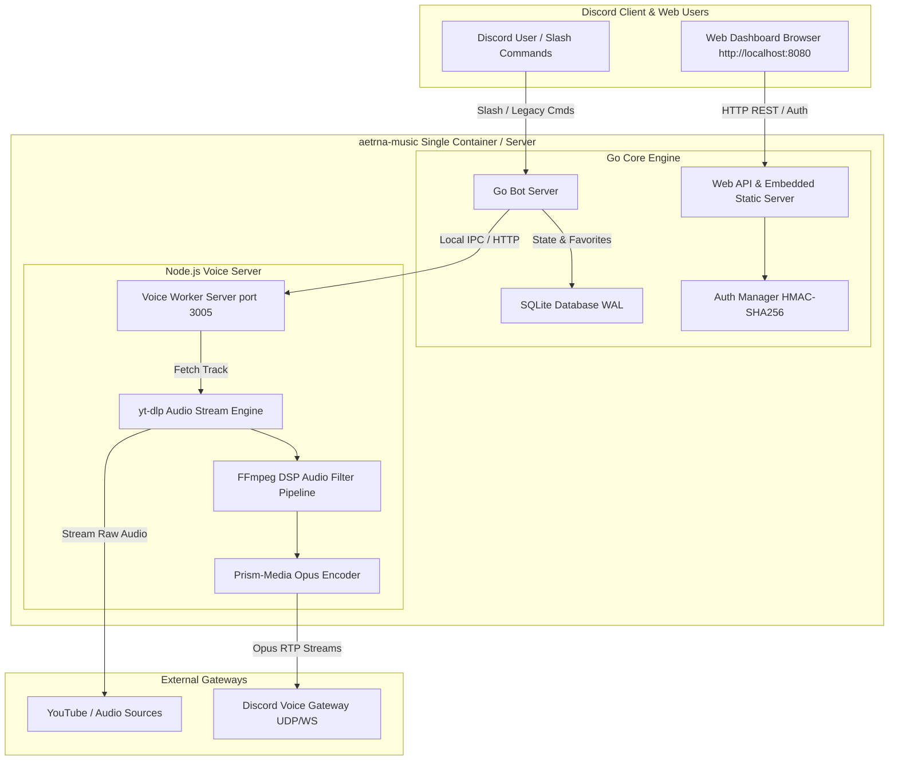

<div align="center">


<sub><i>Official Bot Artwork by <b>@br_lie</b></i></sub>

<br /><br />

# aetrna-music

**A high-performance, Lavalink-free, native Discord Music Engine & Web Dashboard**

[](https://go.dev/)
[](https://nodejs.org/)
[](https://www.docker.com/)
[](#web-control-panel--dashboard)
[](LICENSE)
[](CONTRIBUTING.md)

<br /><br />

> *“Gua cuma Professional AI Prompter. Kalo kodenya agak ajaib tapi lagunya muter lancar jaya, berarti prompt gua gacor.”*
> <br />
> — **[zidanaetrna](https://github.com/zidanaetrna)** *(Professional AI Prompter)*

---

</div>

## Features Highlights

- **100% Lavalink-Free Architecture**: No Java runtime or bulky Lavalink servers required. Consumes only **15–30 MB RAM** per instance using a lightweight native Go core + Node.js voice worker.
- **Embedded Web Control Panel (`http://localhost:8080`)**: Self-hosted split-screen Web Control Panel with HMAC-SHA256 password protection (`DASHBOARD_PASSWORD`), real-time playback control, and live queue monitoring.
- **Interactive Discord UI Cards**:
  - Full-width dynamic album cover cards.
  - Interactive Now Playing Control Bar (Pause, Skip, Prev, Loop, Shuffle, Vol+, Vol-, Filter, Favorite, Stop).
  - Search dropdown select menus.
  - Paginated queue tables with visual playback progress bars.
- **SQLite Persistence Engine**: WAL-mode SQLite database for instant user song favorites (`/favorite`) and custom user playlists (`/collection`).
- **Dynamic Audio DSP Filters**: On-the-fly FFmpeg equalizer filters (Bassboost, Nightcore, Vaporwave, 8D Audio, Pop).
- **Single Container Deployment**: Multi-stage POSIX supervisor container bundling Go, Node.js, FFmpeg, and yt-dlp into one lightweight container.
- **Interactive CLI Setup Wizard**: Initialize configuration in seconds with `npx aetrna-music init`.

---

## Architecture Overview



---

## Quick Start & Installation

Choose your preferred deployment method:

### Option 1: Interactive CLI Setup Wizard (Recommended)

Run the zero-friction interactive wizard to generate `.env` and initialize configuration:

```bash
npx aetrna-music init
```

### Option 2: Docker Compose (1-Click Container)

1. **Clone repository**:
   ```bash
   git clone https://github.com/zidanaetrna/aetrna-music.git
   cd aetrna-music
   ```

2. **Copy environment template**:
   ```bash
   cp .env.example .env
   ```
   Edit `.env` and set your `DISCORD_TOKEN` and `DASHBOARD_PASSWORD`.

3. **Start container**:
   ```bash
   docker compose up -d
   ```
   *Your bot is now running, and the Web Dashboard is live at `http://localhost:8080`!*

### Option 3: Manual Execution (Local Run)

#### Prerequisites:
- **Go**: `1.22+`
- **Node.js**: `22+`
- **FFmpeg**: Installed and added to system `PATH`
- **yt-dlp**: Installed and added to system `PATH`

1. **Install Node dependencies**:
   ```bash
   npm install
   ```

2. **Start Voice Worker (Terminal 1)**:
   ```bash
   node voice-server/server.js
   ```

3. **Start Go Core Bot & Web Server (Terminal 2)**:
   ```bash
   go run ./cmd/bot
   ```

---

## How to Export & Configure YouTube Cookies

YouTube frequently blocks data center IPs, imposes rate limits (429), or restricts age-gated songs. Supplying a valid `cookies.txt` file ensures uninterrupted playback.

### Step-by-Step Cookie Export Guide:

1. **Install Browser Extension**:
   - **Chrome / Brave / Edge**: Install **[Get cookies.txt LOCALLY](https://chromewebstore.google.com/detail/get-cookiestxt-locally/cclelndahbckbenkjhflpdbgdldlbecc)** from Chrome Web Store.
   - **Firefox**: Install **[Get cookies.txt LOCALLY](https://addons.mozilla.org/en-US/firefox/addon/get-cookies-txt-locally/)** from Mozilla Add-ons.

2. **Log into YouTube**:
   - Open `https://youtube.com` in your browser and make sure you are logged into an active account.

3. **Export Cookies File**:
   - Click the extension icon in your browser toolbar.
   - Click **Export** (or **Download**) to save the cookie file.
   - Rename the downloaded file to `youtube_cookies.txt`.

4. **Place in Project Directory**:
   - Place `youtube_cookies.txt` in your project root directory (same folder as `docker-compose.yml`).

5. **Configure `.env`**:
   ```env
   YOUTUBE_COOKIES_PATH=./youtube_cookies.txt
   ```
   *If running in Docker, `docker-compose.yml` automatically mounts `./youtube_cookies.txt` into the container.*

---

## Web Control Panel / Dashboard

`aetrna-music` comes with a self-hosted split-screen Web Dashboard accessible at `http://localhost:8080`.

- **Authentication**: Protected via password authentication configured in `.env` (`DASHBOARD_PASSWORD`).
- **Live Status Monitoring**: Monitor active voice channels, system uptime, and memory usage.
- **Remote Control**: Play, pause, skip tracks, and clear queues directly from your browser.
- **REST API Endpoints**:
  - `POST /api/login` — Authenticate and receive HMAC session token.
  - `GET /api/status` — Get bot stats and active guild queues.
  - `POST /api/control` — Send playback control commands.

---

## Command Reference

| Command | Category | Description |
|---|---|---|
| `/play <query>` | Playback | Search or queue track/playlist from YouTube or Spotify |
| `/search <query>` | Playback | Search tracks with interactive dropdown menu |
| `/pause` / `/resume` | Playback | Pause or resume audio playback |
| `/skip` | Playback | Skip to the next track in queue |
| `/stop` | Playback | Stop playback, clear queue, and leave voice channel |
| `/queue` | Queue | View paginated queue table with progress bar |
| `/nowplaying` | Queue | View Now Playing card with interactive control buttons |
| `/favorite` | Favorites | Save current song to your personal SQLite favorites |
| `/favorites` | Favorites | View and play your saved favorite songs |
| `/collection` | Collection | Save or load custom user playlists (`save <name>`, `load <name>`) |
| `/filter <name>` | DSP Filter | Apply FFmpeg audio filters (`bassboost`, `nightcore`, `vaporwave`, `8d`, `pop`) |
| `/stats` | System | View bot performance & RAM usage |
| `/ping` | System | Check bot heartbeat and WebSocket latency |
| `/ytauth` | Admin | YouTube authentication & cookie troubleshooting guide |

---

## Support & EVM Donations

If `aetrna-music` helped you run a fast, ad-free Discord music bot without expensive Lavalink infrastructure, consider supporting the creator!

**EVM Wallet Address** (ETH / BSC / Polygon / Arbitrum / Base / Optimism):
```text
0xA1a4d3F3A49f4514CCEE434Cfc66837A1fFC687d
```

---

## License & Credits

- **License**: Released under the **[Apache License 2.0](LICENSE)**.
- **Creator**: **[zidanaetrna](https://github.com/zidanaetrna)** *(Professional AI Prompter)*
- **Official Bot Artwork**: **[@br_lie](https://github.com/TheBarli)** (`web/artwork.png`)

<div align="center">
  <sub>Built by <b>zidanaetrna</b> using Go & Node.js</sub>
</div>
