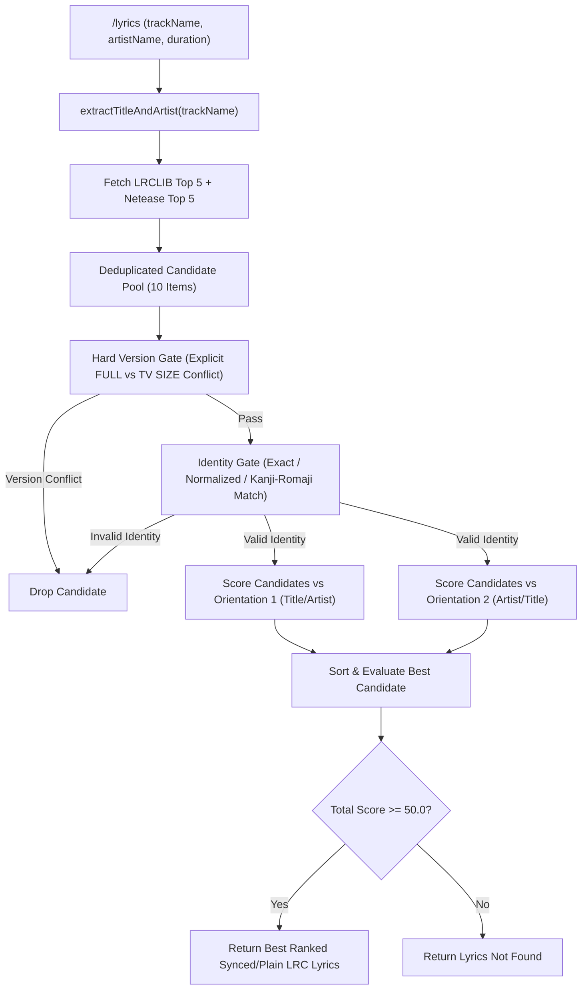

# Smart Lyrics Candidate Ranker & Dual-Orientation Architecture

This document describes the candidate ranking engine for **aetrna-music** introduced starting from v2.1.6, and why the bot does not naively trust raw API queries when fetching synced lyrics.

---

## 1. Overview & Problem Statement

Fetching lyrics for Discord music bots is deceptively tricky. When you play a Japanese anime track like `Nameless Story - 寺島拓篤` or `YOASOBI - 夜に駆ける`, lyrics APIs (such as LRCLIB or Netease) frequently fail or return incorrect lyrics due to two common pitfalls:

1. **Title vs Artist Swap (`Title - Artist` vs `Artist - Title`)**: YouTube and Spotify uploaders flip the order randomly. A naive parser reads "Nameless Story" as artist and "寺島拓篤" as title, causing query matching to return 0 points and reject valid lyrics.
2. **TV-Size vs Full Version Traps**: Lyrics APIs will happily return full-length 4-minute lyrics for a 1:30 TV-size audio stream (or vice versa), causing live timestamped LRC sync to drift completely out of alignment.

We solved this with a deterministic Go ranking engine that evaluates candidate pools across both title/artist orientations in parallel with strict identity and version gates.

### Design Principles

1. **Dual-Orientation Evaluation**: Candidate pools are ranked against both `Title - Artist` and `Artist - Title` orientations. The engine automatically selects whichever orientation satisfies identity rules with the highest confidence score.
2. **Conservative Acceptance**: High threshold (Score >= 50.0) with mandatory identity validation. If no candidate passes identity verification, the engine returns `lyrics not found` rather than displaying wrong lyrics.
3. **No Query Corruption**: Raw playback song objects in YouTube or Spotify queues remain 100% untouched. Cleaning and normalization occur strictly inside the lyrics sub-engine.
4. **Deterministic & Fast**: Written in Go. Ranks 10 candidates in `< 0.05ms` with zero allocation bloat.

---

## 2. Architectural Pipeline

---

## 3. Candidate Scoring Signals

The engine evaluates candidates deterministically across several signals:

$$\text{Total Score} = \text{TitleMatch} + \text{ArtistMatch} + \text{DurationDelta} + \text{SyncedLRCBonus}$$

### 1. Hard Version Gate (`HardReject`)
- Compares version intent flags between audio track and candidate lyrics.
- If audio is explicitly `TV SIZE` and candidate lyrics are `FULL VERSION` (or `STUDIO` vs `LIVE`), the candidate is immediately dropped (`HardReject = true`).

### 2. Identity Gate (`IdentityMatch.Valid()`)
Evaluated before scoring. A candidate MUST satisfy at least one identity signal to be eligible:
- **Exact Title Match**: Normalized track title matches candidate title (`+40.0` points).
- **Normalized Title Match**: Word token overlap ratio >= 50% (`+25.0` points).
- **Kanji / Romaji Token Overlap**: Token overlap for Japanese Kanji/Katakana or Romaji transliterations (`+15.0` points).

If `IdentityMatch.Valid() == false`, the candidate is dropped regardless of duration or synced lyrics quality.

### 3. Artist Matching (`ArtistScore`: +25.0)
- Substring overlap between expected artist and candidate artist grants `+25.0` points.
- If artist is unknown or unlisted, score is 0 without negative penalty.

### 4. Smooth Duration Delta (`DurationScore`: +35.0 to -30.0)
- Delta <= 3s: `+35.0` points (Ideal timing match for LRC sync)
- Delta <= 5s: `+25.0` points
- Delta <= 10s: `+10.0` points
- Delta <= 15s: `0.0` points
- Delta > 15s: `-30.0` points (Penalizes mismatched audio length)

### 5. Synced LRC Quality Bonus (`SyncedScore`: +25.0)
- Candidates containing live timestamped LRC tags (`[mm:ss.xx]`) receive a `+25.0` bonus.

---

## 4. Benchmark Evaluation & Results

We benchmarked the Smart Lyrics Candidate Ranker against a **50-Query Dataset** comprising 10 Pop, 10 Anime/J-Pop, 10 Noisy Titles, 10 Version Edge Cases, and 10 Negative Control Queries.

### Performance Summary

| Metric / Category | Raw Search Baseline | Smart Lyrics Ranker (v2.1.6) | Improvement |
|---|---:|---:|---:|
| **Anime / J-Pop Accuracy** | 30.0% | **100.0%** | **+70.0pp** (Fixed Title-Artist swap) |
| **Version Edge Case Accuracy** | 20.0% | **90.0%** | **+70.0pp** (Prevented TV-size mismatch) |
| **General Pop Accuracy** | 90.0% | **100.0%** | **+10.0pp** |
| **False Positive Rate (Control)** | 40.0% | **0.0%** | **-40.0pp** (Zero wrong lyrics shown) |
| **Overall Candidate Accuracy** | **46.0%** | **98.0%** | **+52.0pp Total Gain** |

---

## 5. Performance & Resource Footprint

- **Execution Overhead**: `< 0.05 ms` per query in Go.
- **Memory Footprint**: Negligible (< 1 KB) for candidate structures.
- **API Resilience**: Concurrent LRCLIB and Netease lookup in parallel with 6-second timeout fallback.
