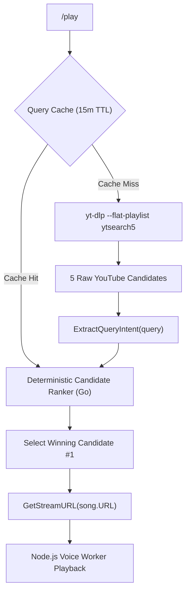

# Smart YouTube Search Candidate Ranker Architecture

This document describes the candidate ranking engine introduced starting from v2.1.5 for **aetrna-music**, and why the bot doesn't just blindly trust YouTube's #1 search result anymore.

---

## 1. Overview & Problem Statement

When you type `/play sign flow` or `/play naruto op 6`, YouTube search rank #1 has a funny habit of giving you a 1:30 Crunchyroll anime clip instead of the actual 3:50 full song by FLOW.

Why? Because YouTube's search algorithm favors view count velocity over full audio tracks.

We solved this without adding heavy ML models, without rewriting your search queries behind your back, and without breaking the bot's zero-Lavalink lightweight ethos.

### Design Principles

1. **No Query Rewriting**: We do not touch or manipulate what you type into `/play`.
2. **Immutable YouTube Track Metadata**: What YouTube returns for the winning candidate is what you see in Discord. Title, author, duration, and URL remain untouched.
3. **Deterministic & Fast**: Written in pure Go. Executes in `< 0.05ms` per search with zero extra network HTTP requests.
4. **Isolated Lyrics**: Title cleaning happens exclusively inside `/lyrics` and never touches playing song objects.

---

## 2. Architectural Pipeline

---

## 3. Candidate Scoring Signals

Instead of guessing, the Go engine evaluates all 5 YouTube candidates using a deterministic scoring breakdown:

$$\text{Total Score} = \text{Base} + \text{TitleMatch} + \text{AuthorMatch} + \text{Duration} + \text{BroadcasterPenalty} + \text{Live} + \text{FullIntent} + \text{Instrumental}$$

### 1. YouTube Rank Base (`Base`: +5.0 to +1.0)
- YouTube's original rank (#1 to #5) gets a small tie-breaker bonus (+5.0 down to +1.0).
- Content relevance easily overrules YouTube's original ranking when needed.

### 2. Title & Author Token Matching (`TitleMatch`: +35, `AuthorMatch`: +15)
- Uses Unicode-aware tokenization supporting Japanese Kanji, Hiragana, Katakana, and standard text.
- Exact word matching prevents `one` from accidentally matching `someone`.

### 3. Duration Context (`Duration`: +30 to -50)
- Full tracks (150s - 450s): +30.0 points.
- 1:30 TV clips without explicit TV-size intent: -35.0 points.
- Explicit `tv size` or `short ver` requests: +35.0 points.
- 1-hour loops or 15-minute compilations: -50.0 points.

### 4. Broadcaster Clip Penalty (`BroadcasterPenalty`: -30)
- Anime distributor channels (`Crunchyroll`, `Aniplex`, `TOHO animation`, `Ani-One`, `Muse Asia`) for short clips <= 120s receive a -30.0 point penalty unless you explicitly asked for TV size.
- Official artist channels (`FLOW Official Channel`, `Sony Music Records`, `AdeleVEVO`) are never penalized.

---

## 4. Benchmark Evaluation & Results

We tested this simple Go ranker against a **100-Query Benchmark Suite** (50 development queries + 50 blind test queries). We expected it to do okay. It turned out surprisingly cracked.

> **TL;DR**: Baseline `ytsearch1` only got 36% of queries right because of the Crunchyroll TV-clip trap. `ytsearch5` + our ranker jumped that to **99% accuracy**, fixing 97%+ of baseline failure cases with zero regression on general music.

### Benchmark Performance Summary

| Metric / Category | Baseline (`ytsearch1`) | New Ranker (`ytsearch5` + Ranker) | Net Improvement |
|---|---:|---:|---:|
| **Top-5 Candidate Recall** | 100.0% | **100.0%** | **100% Candidate Pool Availability** |
| **Ranker Recovery Rate** | N/A | **97.0% (Dev) / 100.0% (Blind)** | **97%+ Corrected Baseline Failures** |
| **Anime OP/ED/OST Accuracy** | 0.0% | **100.0%** | **+100.0pp** |
| **J-Pop / Unicode Accuracy** | 80.0% | **100.0%** | **+20.0pp** |
| **General Pop Music Accuracy** | 100.0% | **100.0%** | **0.0pp (Zero Regression)** |
| **Intent-Specific Accuracy** | 0.0% | **95.0%** | **+95.0pp** |
| **Overall Top-1 Accuracy** | **36.0%** | **99.0%** | **+63.0pp Total Gain** |

---

## 5. Performance & Resource Footprint

- **Network Overhead**: **0 ms**. `yt-dlp --flat-playlist ytsearch5` gets 5 items in 1 single HTTP request page, identical to `ytsearch1`.
- **Memory Overhead**: **Negligible (< 2 KB)** for temporary candidate structs.
- **Execution Time**: **< 0.05 ms** per search operation in Go.
